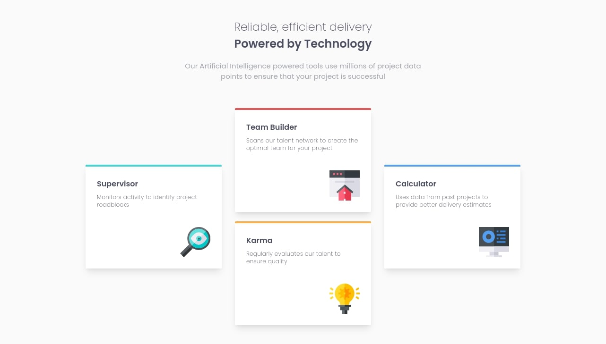

# Frontend Mentor - Four card feature section solution

This is a solution to the [Four card feature section challenge on Frontend Mentor](https://www.frontendmentor.io/challenges/four-card-feature-section-weK1eFYK). Frontend Mentor challenges help you improve your coding skills by building realistic projects.

## Table of contents

- [Overview](#overview)
  - [The challenge](#the-challenge)
  - [Screenshot](#screenshot)
  - [Links](#links)
- [Built with](#built-with)
- [Author](#author)

## Overview

### The challenge

Users should be able to:

- View the optimal layout for the site depending on their device's screen size

### Screenshots

  

### Links

- Solution URL: [https://www.frontendmentor.io/solutions/responsive-four-cards-feature-section-with-tailwind-css-and-flexbox-Zt6pkB0GW](https://www.frontendmentor.io/solutions/responsive-four-cards-feature-section-with-tailwind-css-and-flexbox-Zt6pkB0GW)
- Live Site URL: [https://sissokho.github.io/frontendmentor-four-card-feature-section/](https://sissokho.github.io/frontendmentor-four-card-feature-section/)

## Built with

- Semantic HTML5 markup
- Tailwind CSS
- Flexbox
- Mobile-first workflow

## Author

- Frontend Mentor - [@sissokho](https://www.frontendmentor.io/profile/sissokho)
- Twitter - [@mm_sissokho](https://twitter.com/mm_sissokho)
- Linkedin - [Mouhamadou Moustapha SISSOKHO](https://www.linkedin.com/in/mouhamadou-moustapha-sissokho-548a55125/)
